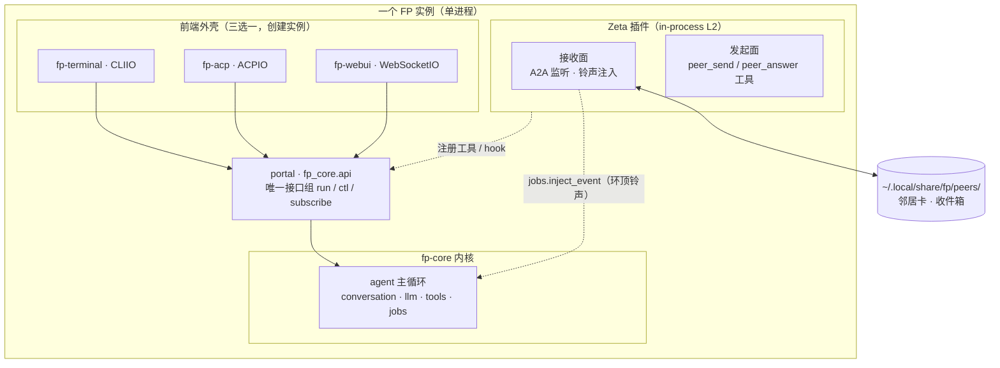
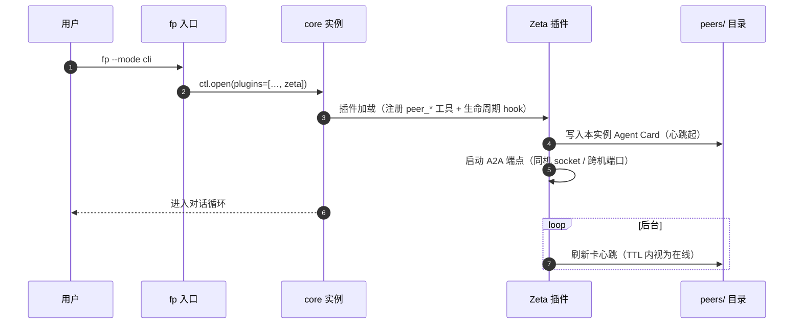
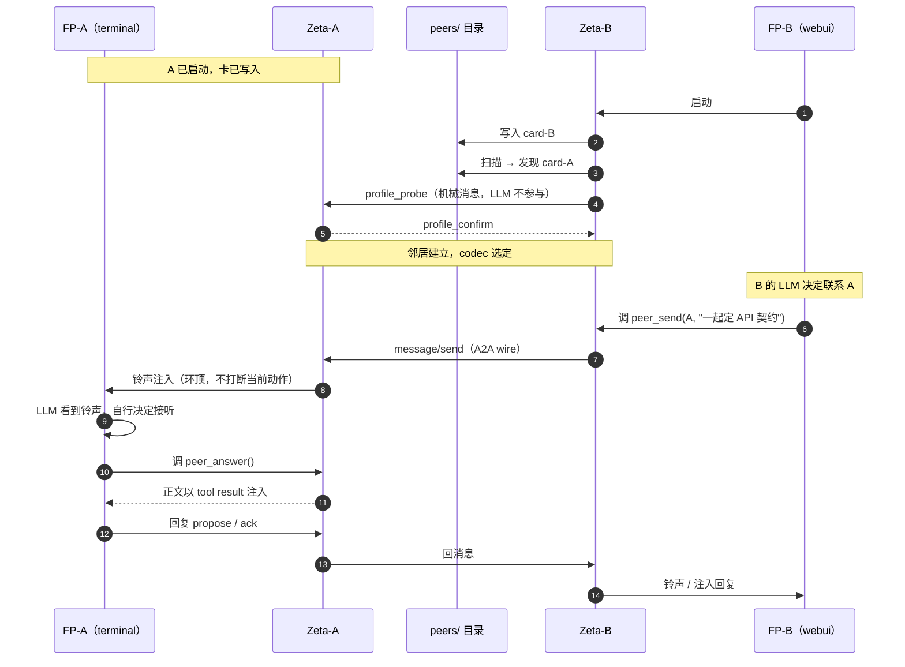
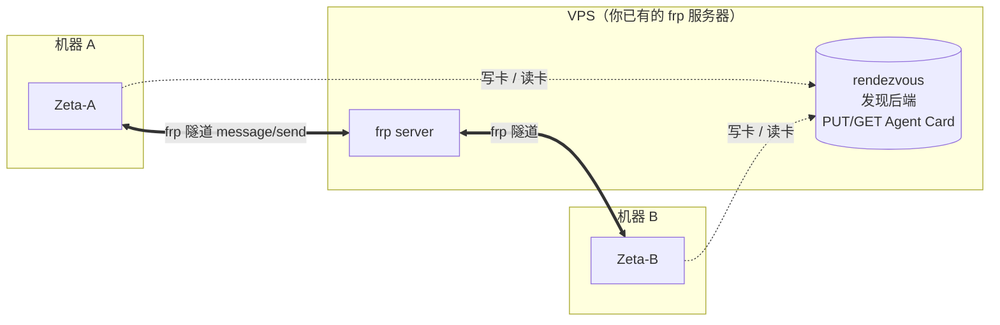
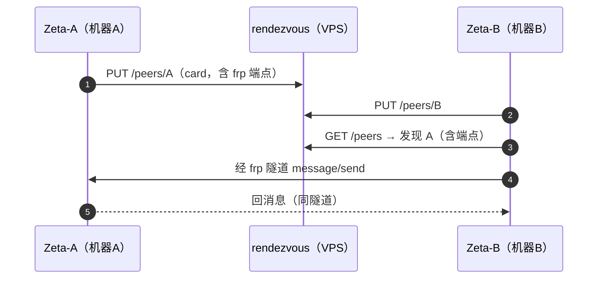

# Zeta 协议总览

> 本文件是 `zeta_邻居领域模型.md` + `zeta_契约schema.md` 的导读。
> Zeta = 让多个对等 AI agent 实例「像邻居一样协作」的协议栈。

## 一句话

**Zeta 让多个对等 agent 实例（FP ↔ FP，以及 FP ↔ 外部异构 agent）像邻居一样协作：
没有上下级、可以不同时在线、任一方都能主动找对方，靠一份共同签署的契约达成一致，
而不是靠某个中心的指挥。**

## 为什么需要它（与 agent_dispatch 的根本区别）

| | agent_dispatch（旧） | Zeta（邻居） |
|---|---|---|
| 协作的抽象 | **函数调用**：spawn → 等 stdout → 拿字符串 | **对话**：投递消息、多轮、可离线留话 |
| 参与者 | 一次性、被阉割的 worker | 完整实例（有自己的工具、记忆、多轮） |
| 关系 | 主编排器是唯一权威（上下文一满就丢线） | 对等，无中心，任一方可发起 |
| 异构 | 只能接自己的子进程 | 能接任何说 A2A 的第三方 agent |
| 一致性 | 主编排器裁决 | **双方共同签署的契约**（谁也不能单方改） |

一句话：**旧模型是「我调用你」，新模型是「我们是邻居，有事打电话商量」。**

## 分层

```
应用语义层   契约 profile（fp-contract-profile）—— 邻居谈成的共享契约
    ↑
领域模型层   NeighborCard / Envelope / 注入策略 / 发现（协议无关的中间表示 IR）
    ↑
Codec 层     a2a_codec | fp_direct_codec | ...（可插拔，一邻居一档）
    ↑
传输层       localhost | tcp | frp（可插拔）
```

两个设计约束贯穿所有层：

1. **删掉 codec 后，领域模型测试必须全绿**——协议可替换，形状不渗透进语义；
2. **删掉 contract profile 后，通信仍然可用**——协作范式是通信之上的应用层。

## 核心不变式（红线）

1. **LLM 的输出不是可信输入**——凡进入协议状态（契约、卡、协商结论）的，
   必须存在一条非 LLM 的确定性校验路径。信任根不许放在任何实例的嘴里。
2. **机械消息永不注入 LLM**——ack/hash/心跳/离线回执由网关直接应答，省钱、缩小幻觉面。
3. **人类无条件优先，且是抢占式的**——远程注入不得决定本地用户体验。
4. **hash 锁字节，schema 锁语义**——LLM 只产候选，一致性由 hash 判，正确性由 schema 判。
5. **兼容性由机器计算，不采信声明**——"我说这是小改动"骗不过 diff 工具。
6. **扩展必须可忽略；安全区未知字段 fail-closed**——忽略它会改变核心语义的，不是扩展，是核心变更。
7. **对话可断可丢，契约不能**——真正持久的产物是契约文件，不是会话。
8. **权威外化到契约**——没有中央，没有"领导进程"；对等网络里没有单方修改权。

## 一个完整的故事（后端 ↔ 前端）

```
1. 发现    A、B 各自在共享目录写自己的卡；启动扫描时互相看见
2. 拨号    A 的 LLM 干到一半发现要定 API → 调 peer_send(B, propose)
3. 传话    B 的 Zeta 收到 → 忙则入队，闲则注入 B 的实例
4. 协商    A: propose(契约全文, hash=X) → B 校验（结构/作用域/兼容/安全区）
           → B: ack(hash=X) 或 counter(hash=Y)
5. 落盘    hash 对上 → 双方签名 → 契约进交换区（写权：提议方写、确认方校验）
6. 干活    各自按契约建自己的代码，谁也没改对方的文件
7. 演进    要改契约 → 走 expand-contract：加字段→迁移期→全员验证后才收缩
```

**离线时**：B 没开机 → A 的 `peer_send` 立即拿到「对方离线」回执 → A 决定
「用默认契约先干 + 留待补议」或等下次。**邻居搬家了也无所谓。**

**异构时**：对方是外部 A2A agent → 按其卡的能力声明决定协商深度；
只会裸 A2A → 降级模式，结果标 UNVERIFIED，落盘前过本地 schema 校验。

## 部署形态：Zeta 住在哪里

**结论：Zeta 是插件，每个 FP 实例各带一个。**

- 当前形态：一个前端进程 = 一个 FP 实例。`fp --mode cli|webui|acp` 三选一，
  进程内 `ctl.open()` 建**一个** core 实例（terminal/acp/webui 是三种外壳，互斥）。
- Zeta 作为 **in-process 插件**随实例加载（默认开、可配置关）：
  **用户启动任何前端，就同时拉起了这个实例的 Zeta。**
- 同一用户开两个实例（如一个 terminal、一个 webui），它们就是**对等邻居**；
  跨机则把卡里的 endpoint 换成 frp 地址，其余机制不变。

### 图 1：Zeta 与三前端 / core 的关系



要点：**Zeta 不穿透 portal 去改 core**——它作为插件以 L2 身份合法引用 L1
（`jobs` 注入队列、`LifecycleHook`），这是 core 预留的扩展点，不是绕过。

### 图 2：启动流程（以 terminal 为例）



**回答「启动前端会拉起自己的 Zeta 吗」：会**——Zeta 是随实例加载的插件。
这意味着每个实例一出生就是邻居网络的一员（默认开）。

### 图 3：两个 FP 的发现与交换



**离线场景**：若 B 启动时 A 不在线——卡的 TTL 过期 → B 判定 A 离线 →
消息进 `peers/A/inbox/` 收件箱（at-least-once + 幂等键）→ A 下次上线扫描投递。
**发现靠共享目录、交换靠 A2A，两者都允许对方不在线。**

### 图 4：跨网络（没有共享文件夹怎么办）

**核心统一：把「发现」和「传输」都做成可插拔插槽**——同机用文件 + 本地 socket，
跨机用 rendezvous + frp，领域模型不感知差别。

| 插槽 | 同机 | 跨机 |
|---|---|---|
| 发现后端 | `SharedDirBackend`（`~/.local/share/fp/peers/`） | `RegistryBackend`（VPS 上的 rendezvous：HTTP PUT/GET 卡）或 `StaticConfigBackend`（配置写死邻居） |
| 传输 | local socket | frp 隧道（VPS 中转） |





**功能优先、允许稍不安全**：跨机 MVP 用最简方案——静态配置邻居清单（写死 frp 地址）
或一个共享的 rendezvous 目录（VPS 上的文件 / HTTP），明文 + 共享 token 认证即可。
不上 OAuth / 零信任，等真需要再说。

所以「跨网络如何处理」的答案是：**没有文件夹，就把文件夹换成一个 rendezvous 后端**——
与同机机制同构，只是发现后端换实现。

### 公网互联方案（设计存档，暂不实现）

> 状态：**已定方案，未排期**。大部分使用场景在本地（同机多实例），公网互联属未来需求。
> 此处存档，避免将来重新推导。

**问题的正确拆法**：不是「要不要服务器」，而是「哪个面需要服务器」。

| 面 | 作用 | 可否去掉 |
|---|---|---|
| **会合（控制面）** | 两个互不知道公网地址的 peer，先有个都认识的地方交换地址 | **几乎不可去掉**（除非 IPv6 固定地址或静态配置） |
| **转发（数据面）** | 地址换到后，数据包怎么走 | **可去掉**——可直连，也可中继 |

frp 把两件事都压在服务器上（会合 + 转发），这是**最重**的解法，不是唯一解法。

**从最干净到最兜底的光谱**：

| 方式 | 会合 | 数据面 | 成功率 | 备注 |
|---|---|---|---|---|
| IPv6 直连 | 只需 DNS | 直连 | 看双方 v6 | 唯一能近似消灭会合点的方案 |
| 公网 IP 直连 | 静态/DDNS | 直连 | 需一方公网 | 最省 |
| UPnP / NAT-PMP | 无（问路由器） | 直连 | 看路由器 | 常被关 |
| UDP 打洞（STUN） | 信令服务器（只牵线） | 直连 | ~70–90% | 服务器接完线即退出，不碰数据 |
| 中继（TURN / frp） | 服务器 | 走服务器 | 100% | 兜底，带宽成本归服务器 |

**NAT 现实是硬墙**：锥型 NAT（多数家宽）可打洞；**对称 NAT** / **CGNAT**（4G/5G、部分宽带）
打洞基本失败，只能中继。所以成熟方案从不赌单一手段——**ICE 就是「先直连 → 再打洞 → 最后中继」的组合拳**。

**对本项目的落点：传输层插槽（推荐借力，不自研）**

```
传输层插槽
├── local socket          同机（现成）
├── frp 隧道              ⚠️ 纯中继，简单但带宽走 VPS
├── Tailscale / WireGuard ✅ 打洞为主 + 自建 DERP 中继兜底 + 虚拟 IP 透明 ← 推荐
└── 自研 STUN 打洞        ✗ 不做（造轮子，且要处理对称 NAT）
```

**核心判断**：公网互联是**传输层**的问题，不是协议层的问题。而该问题已有成熟产品解决
（Tailscale 给每台机器一个「看起来像局域网的 IP」，底层自动打洞/中继）——**接进来当传输层，
Zeta 协议代码一行不改**。这又一次兑现「传输可插拔」的设计红利。

## 文档地图

| 文档 | 内容 |
|---|---|
| `zeta_邻居领域模型.md` | 通信面：邻居表、信封、注入策略、发现、边界情况、注入冲突 |
| `zeta_契约schema.md` | 协作面：契约结构、版本演进（expand-contract）、防债原则 |
| 本文件 | 导读 |

## 演进状态

- P0 领域模型：草案 v0.2（已双路评审对撞）
- P0 契约 schema：草案 v0.3（已双路评审对撞，deprecations 结构定死）
- P1 a2a_codec / P2 契约机 / P3 邻居化：未开始
- **胜负手**：双实例实验——两个平级完整 FP 实例投一个小任务，观察能否自己
  认领、互发消息、达成契约验收。**没过这一步，任何大规模实现都是赌直觉。**
